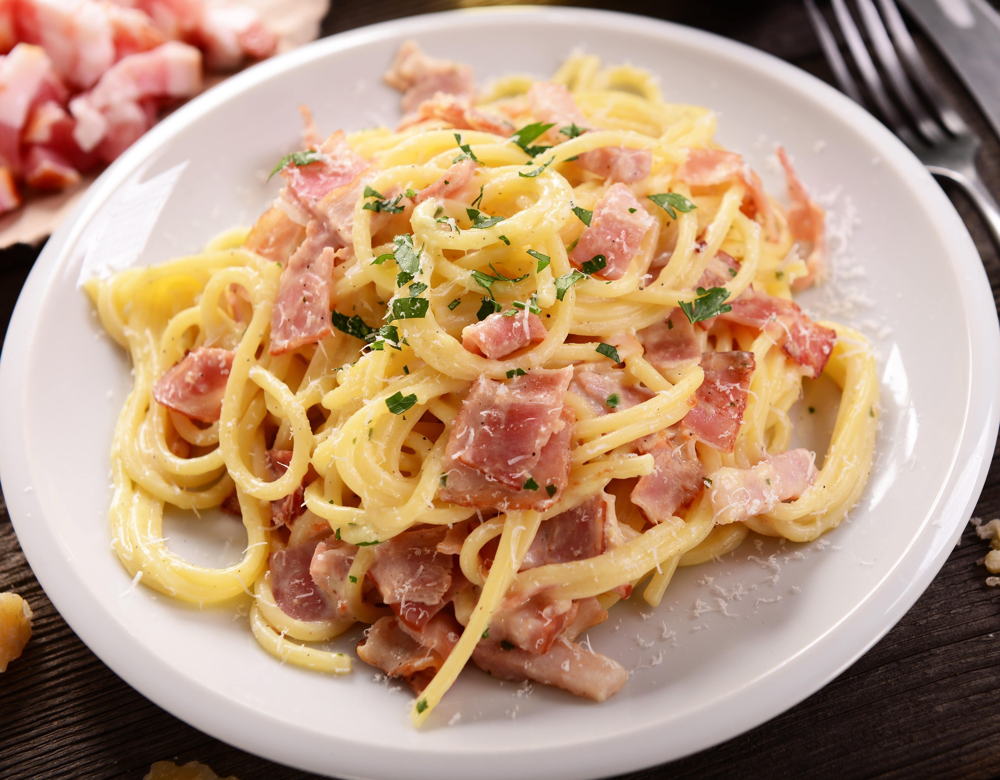
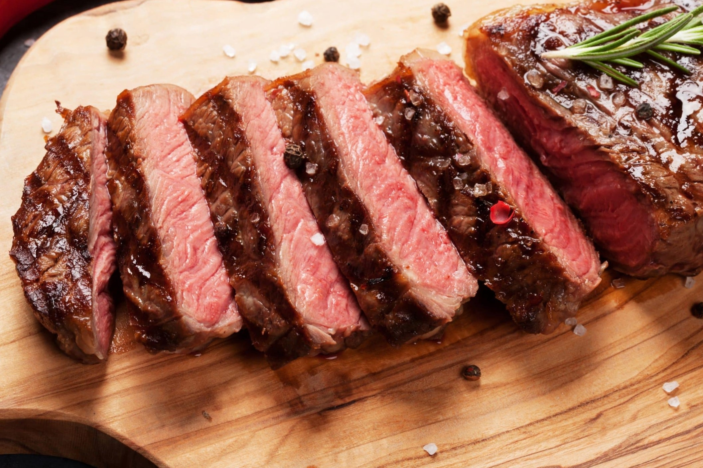
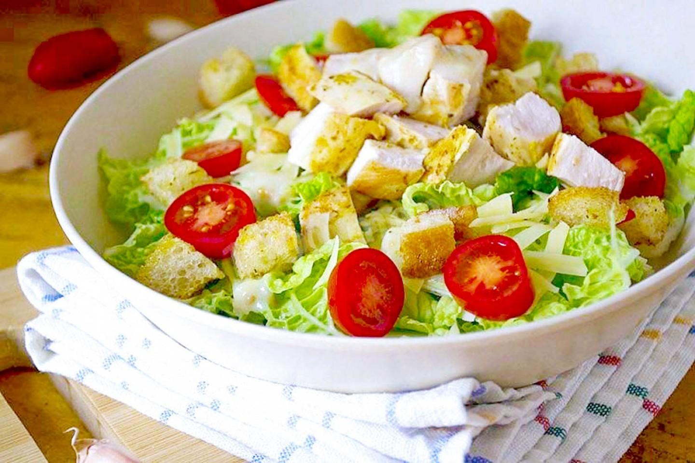

<html lang="ru">
<head>
    <meta charset="UTF-8">
    <meta name="viewport" content="width=device-width, initial-scale=1.0">
    <title>Ресторан "Вкусно и Сладко"</title>
    
</head>
<body>

<header>
    <h1>Ресторан "Вкусно и Сладко"</h1>
    
Лучшие блюда города

</header>

<nav>
    <a href="#menu">Меню</a>
    <a href="#about">О нас</a>
    <a href="#contact">Контакты</a>
</nav>

<section class="hero">
    Добро пожаловать!
</section>

<section id="menu" class="menu">
    

        
        <h3>Паста Карбонара</h3>
        
Классическая итальянская паста с беконом и сливочным соусом.

    

    

        
        <h3>Стейк Рибай</h3>
        
Сочный стейк средней прожарки с овощами гриль.

    

    

        
        <h3>Салат Цезарь</h3>
        
Хрустящий салат с курицей, сухариками и соусом Цезарь.

    

</section>

<section id="about" style="padding: 40px 20px;">
    <h2>О нас</h2>
    
Наш ресторан предлагает только свежие и качественные продукты. Мы готовим с любовью и заботой о каждом госте.

</section>

<section id="contact" style="padding: 40px 20px;">
    <h2>Контакты</h2>
    
Адрес: ул. Примерная, 10

    
Телефон: +7 (777) 123-45-67

</section>

<footer>
    &copy; 2026 Ресторан "Вкусно и Сладко". Все права защищены.
</footer>

</body>
</html>
